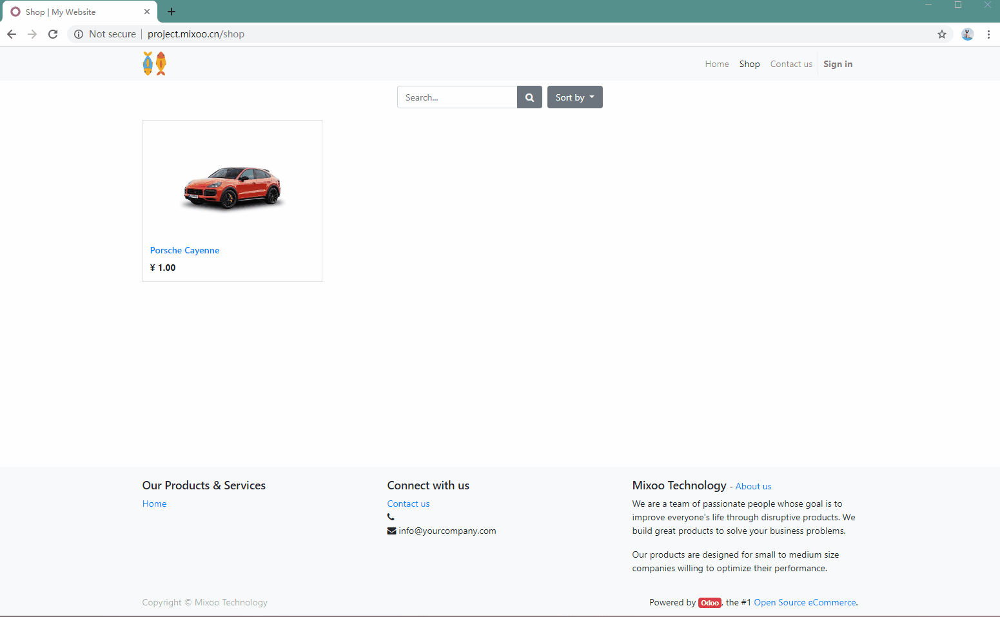
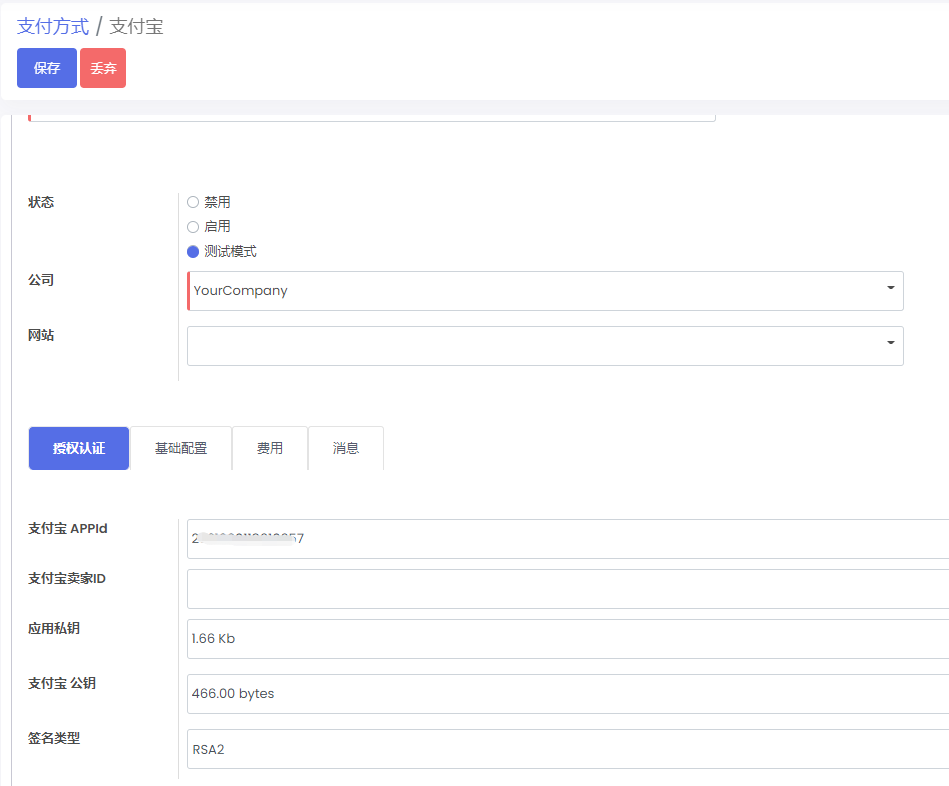
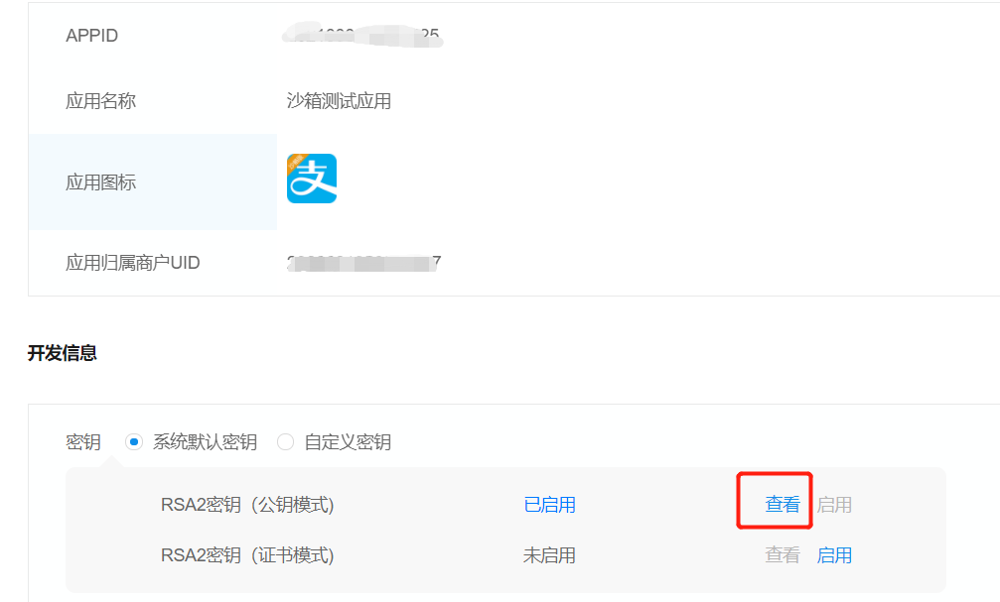
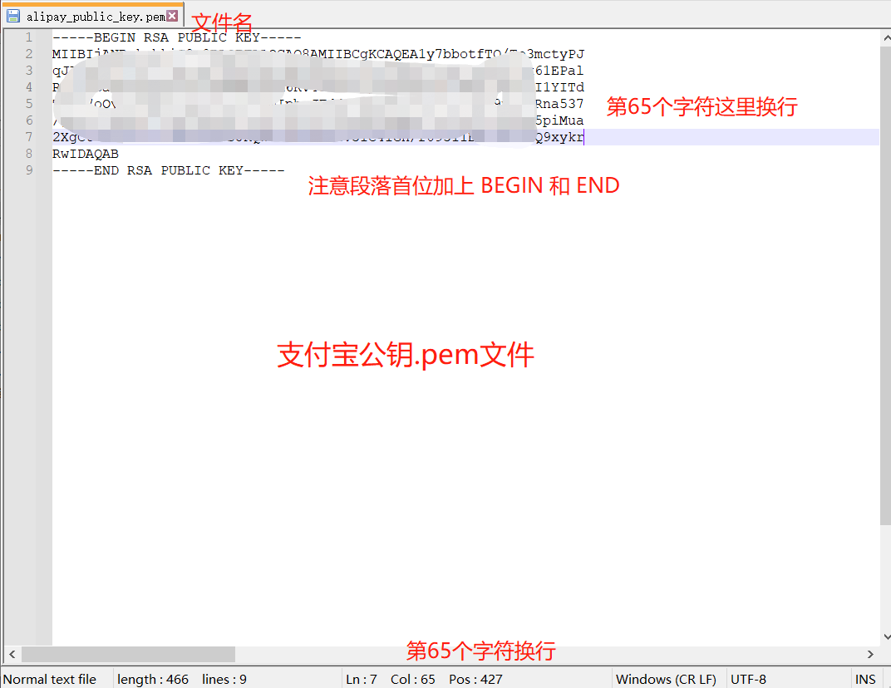
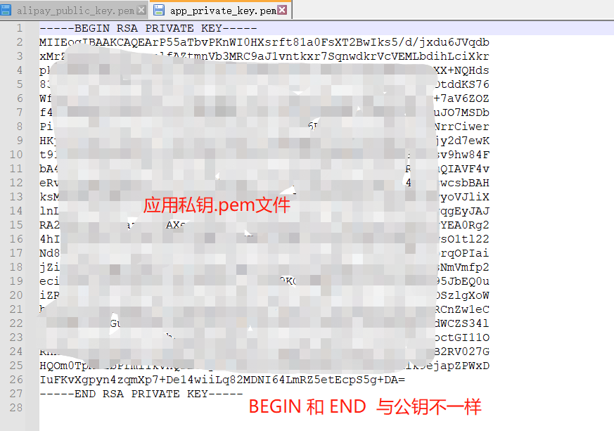
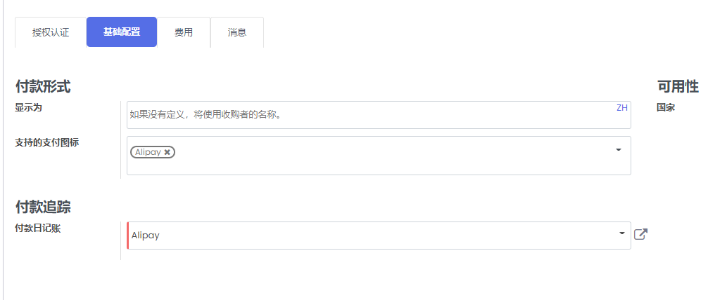

odoo 支付宝支付模块

# 致谢

- 本模块基于 jellyhappy大佬的项目：https://github.com/jellyhappy/payment_alipay 
- 修改了部分源码，使之可在odoo14上正常运行

# About

注意：本模块不兼容官方支付宝模块，如果已安装了官方模块(odoo/addons/payment_alipay），请先卸载再安装本模块。

## Requirements

python >= 3.6

odoo = 13.0 / 14.0

## Main functionalities

* 支付设置
* 线上商城支付宝支付

## 使用示例

### 补充说明

- **这是本人** https://github.com/King-Of-Game  **附加的说明**
- （原作者太坑了，密钥文件格式问题我弄了半天）

### 授权认证部分

1. 设置支付方式时，有四个为必填项。

   1、APPID， 应用私钥，支付宝公钥请在支付宝开放平台申请沙箱测试应用，配置后查看

   - 配置成功后把应用私钥和支付宝公钥的文本内容，按照第二步写入.txt文件中，再直接修改后缀为.pem

   

   2、我们这里的应用私钥和支付宝公钥采用上传.pem文件的方式，所以有严格的格式要求

   

   

   

   

### 基础配置

- 付款日记账这里设置为我们这个模块（这是必填项）
- 

#  结语

如果觉得对你有帮助，可以请作者喝瓶怡宝，哈哈~

- 微信

- 支付宝

